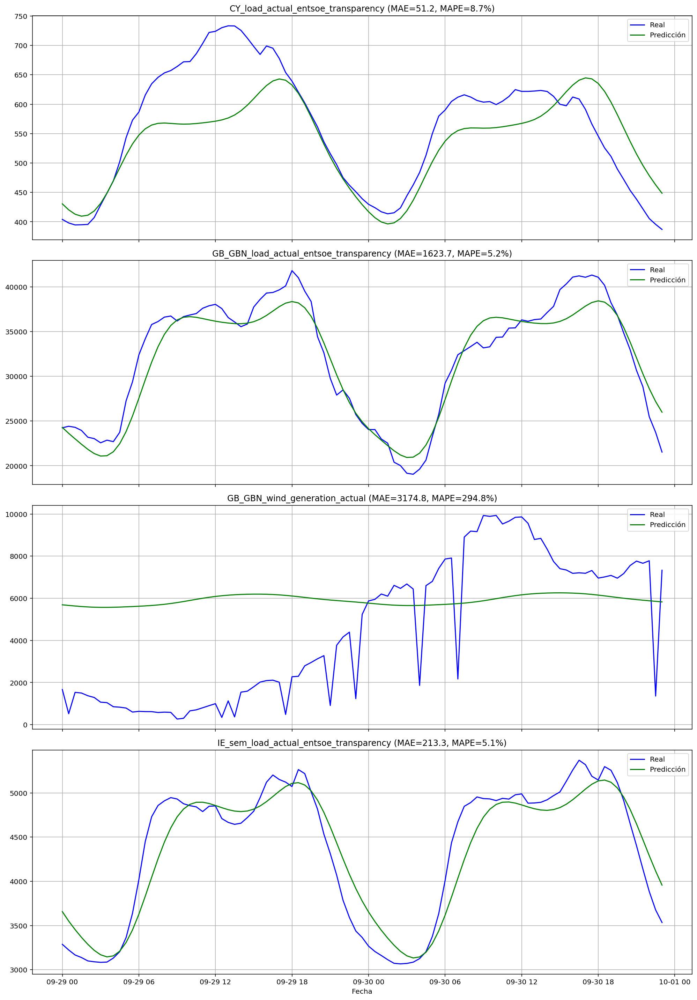
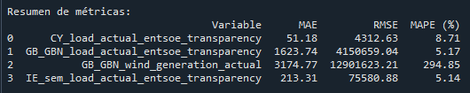

# Predicción de Cargas Energéticas con Prophet

Este proyecto permite predecir series temporales relacionadas con la demanda y generación de energía eléctrica en distintas regiones, utilizando el modelo `Prophet` de Meta. Las predicciones se visualizan y se evalúan con métricas de error como MAE, RMSE y MAPE.

## 📄 Archivo principal

El script principal del proyecto es:  
**`predictor_prophet.py`**

Este archivo:

- Carga un dataset de series temporales (`time_series_30min_singleindex.csv`).
- Aplica el modelo Prophet a varias variables de interés.
- Grafica las predicciones comparándolas con los valores reales.
- Calcula métricas de desempeño (MAE, RMSE, MAPE).
- Muestra un resumen de resultados.

## 📦 Librerías necesarias

Asegúrate de tener instaladas las siguientes librerías de Python:

- [`pandas`](https://pandas.pydata.org/)
- [`matplotlib`](https://matplotlib.org/)
- [`prophet`](https://facebook.github.io/prophet/)
- [`scikit-learn`](https://scikit-learn.org/stable/)

Puedes instalarlas todas con:

```
pip install pandas matplotlib prophet scikit-learn

```

## ⚙️ Nota importante sobre Prophet

> La instalación de `prophet` puede requerir compilar dependencias.  
> Si usas **Windows**, se recomienda instalarlo dentro de un entorno virtual (`venv`) o mediante `conda`.

---

## 📁 Dataset

El dataset utilizado puede descargarse desde la siguiente URL oficial:  

[Open Power System Data — Time Series](https://data.open-power-system-data.org/time_series/2020-10-06)

Dentro de la descarga, el archivo principal para este proyecto es:

`time_series_30min_singleindex.csv`

Este archivo contiene múltiples columnas relacionadas con:

- Carga eléctrica real y pronosticada  
- Generación eólica y solar  
- Capacidad instalada  

Todo en diferentes regiones europeas, en intervalos de **30 minutos**.

---

## 📊 Variables utilizadas

En este ejemplo se utilizan las siguientes columnas del dataset:

- `CY_load_actual_entsoe_transparency`
- `GB_GBN_load_actual_entsoe_transparency`
- `GB_GBN_wind_generation_actual`
- `IE_sem_load_actual_entsoe_transparency`

Estas variables pueden modificarse fácilmente dentro del script, en la lista `variables`.

---

## 📈 Resultados esperados

Por cada variable analizada, el script generará:

- Un **gráfico** comparativo entre los valores reales y la predicción generada por `Prophet`.
- Una **tabla resumen** con las métricas de evaluación del modelo:

---

## 📊 Resultados Visuales

A continuación, se incluyen ejemplos de los gráficos y resumen generados:

### Comparación Real vs Predicción



---

### Resumen de Métricas



---
##🚀 Cómo usar este proyecto

Para ejecutar el proyecto, sigue estos pasos:

Clona o descarga este repositorio.

Descarga el dataset desde el enlace indicado y colócalo en la raíz con el nombre time_series_30min_singleindex.csv.

---
## 📥 Clonar este repositorio

Puedes clonar el repositorio con el siguiente comando:

```
git clone https://github.com/juanpyR/prediccion-series-energia-prophet.git

```

Luego entra a la carpeta del proyecto:

```
cd prediccion-series-energia-prophet

```
##🤝 Contribuciones
Este proyecto está abierto a mejoras y sugerencias. Puedes colaborar abriendo un issue o enviando un pull request.
